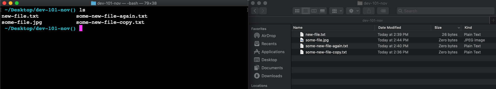

Terminal
===

> Your developer portal!

## Prerequisites

Installed including `git`

## Why?

1. Speed of use (keyboard)
1. Simplicity (no UI)
1. Power (can be dangerous 🔥)
1. Additional tools run from here (CLI): `git`, `npm`, `heroku`

## Compare to GUI

Setup side-by-side Terminal and Finder/GUI

### Compare and Contrast!

Where am I?

```sh
> pwd
```

What is home directory (`~`)?

Lost? Go Home:

```sh
> cd
```

What's in this directory?

```sh
> ls
```

### Cleaning up

Visually clear out commands:

```sh
> clear
```

## Hint: Have the finder open

On mac:
`open .`

On WSL:
`explorer.exe .`


## Files and Directories

### Paths

sigil | meaning
--- | ---
`~` | home
`/` | root (and path separator)
`.` | current directory
`..`| parent directory

### Autocomplete ⌨️ 🔣

sigil | meaning
--- | ---
`TAB` | auto-complete (**use me!**)
`⬆⬇` | navigate history
`CTRL` + R | find in history
`CTRL` + A | go to beginning of line
`CTRL` + E | go to end of line

### Warning!

Removing things from the command line does **not** put them in the trash/recycling. They are gone. Forever. These commands are marked with 🔥 below

### Commands, arguments, and flags

Commands can be broken down into three parts:

`command argument -flag`

A **command** is the name of the program you're running.

- Example: `sl` will launch an animation of a train (**S**team **L**ocomotive)

A **argument** is the input you're operating on.

- Example: `cowsay "hello!!!"` will show a picture of a cow saying "hello!!!". 
    - `cowsay` is the command. 
    - `"hello!!!"` is the argument.
- Example: `cd ./localdev` tells the `cd` program to go to the `./localdev` directory. 
    - `cd` is the command
    - `./localdev` is the argument

A **flag** is configuration about how to run that input.

- Example: `sl -F` will configure that train to 'fly'
    - `sl` is the command 
    - `-F` is the flag

- Example: `sl -l` will configure that train to be little.
    - `sl` is the command 
    - `-l` is the flag

### Directory Commands

command | meaning | notes
--- | --- | ---
`cd` | change `<directory>` | can use relative paths!
`ls` | list `<directory>` | `ls -la` for system files
`ls -R` | list `<directory>` | `ls` recursively
`mv` | move `<directory>` `here` | takes two arguments: `from` **and** `to`
`mv` | rename `<directory>` `new-name` | takes two arguments: `from` **and** `new name`
`mkdir` | make `<directory>` | can pass multiple directories to create
`rmdir`🔥 | remove `<directory>` | doesn't work if directory has files
`cp -r` | copy `<directory>` `here` | takes two arguments: `from` **and** `to`

**Demo: let's take a journey through the root and home directories...and back again!**

**Please, please, pleaaaaassse don't delete anything in your root directory**

**Please, please, pleaaaaassse don't delete anything in your root directory**

**Please, please, pleaaaaassse don't delete anything in your root directory**

### File Commands

command | meaning
--- | --- 
`touch` | create `<file>`
`cat`   | read `<file>`
`echo "content" > file` | write a quick snippet to a file
`cp` | copy `<file>` `here` | takes two arguments: `from` **and** `to`
`rm`🔥 | remove `<file>`
`rm -rf`🔥 | remove `<file or directrory>` and all of its children

## Complicated moves!

imagine the following file tree:

```
parent-dir
    |- child-dir
        - child-item.txt
    |- sibling-dir

```

### Options for moving an item from a child directory to a parent directory:

Go into the directory and lift it up from inside
```
cd child-dir
mv child-item.txt ../
```

or! 

Maneuver out from the current directory
```
mv ./child-dir/child-item.txt ./
```

---

### Options for moving an item from a child directory to a sibling directory:

Go into the directory and lift it up from inside
```
cd child-dir
mv child-item ../sibling-dir
```

or

Maneuver it from the current directory

```
mv ./child-dir/child-item ./sibling-dir
```

## Bash aliases

`~/.bash_profile` and `~/.bashrc` (on mac, sometimes `~/.zshrc`)

These files are basically the configuartion files for your terminal. They are full of terminal commands,and they are run whenever you open a terminal.

Notice the `.` before the filename. That makes it a hidden file. To see hidden files, you need to `ls -la`.

These config files. are a good place to put shortcuts (`alias`es) for yourself. For example, imagine you are sick and tired of typing `git add . && git commit -m` over and over. You can add a line to your `.bash_profile` like so:

```sh
alias gac='git add . && git commit -m'
```

Then close and reopen your terminal (alternatively, you can `source ~/.bash_profile`).

Now you can type `gac` instead of the whole thing.

NOTE: When installing `nvm`, you might have to put stuff in one of these files to get it working.

## Outcome

Let's add everyone to the github repo so you can see the instructions!

> Do terminal challenge!
