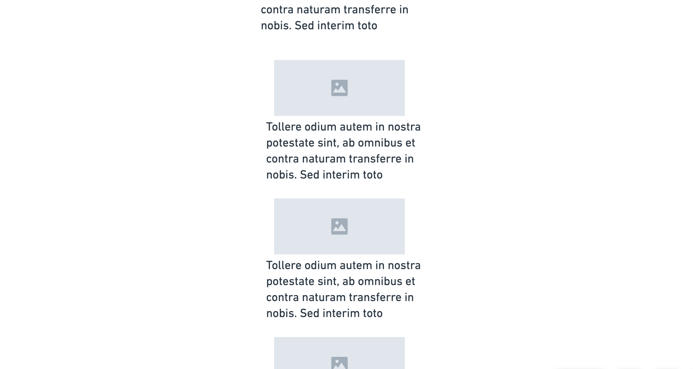

## HTML and CSS -- lists of things

Create a list of things with images. Pick a theme and you can search and copy url's from the interwebs.

## Standard Setup Process

1. Create a repo called `lab-02b-image-gallery` on Github
    - make sure to click add a `README.md`
1. Copy the URL of the new repo
1. From the command line (terminal) clone your repo:
    1. Check with `pwd` that you are in correct directory for labs
    1. `git clone <url>`
    1. **`cd` into your repo from the command line**
    1. Launch vscode with `code .`

## Remember To...

1. Read through this entire lab document
1. **Have a plan.** 

## Image Gallery

### **Wireframes**

Use these 2 wireframe designs for an image gallery site. One wireframe has all of the images lined up vertically in a single column. The other wireframe is a grid of images instead. In both wireframes, each image should be inside a container with a caption

List example:

Grid Example:

### Build out HTML and CSS

1) in your `index.html`, make a `main` tag with an `div` inside
1) Give the `div` a `class='gallery-list-item'` attribute, and style this tag in `style.css`. Each `gallery-list-item` must also have an image of some kind and a link of some kind. Make the width something around `200px`
1) Now, copy and paste this `div` seven times, and change the caption and image in every copied image item.
1) by default, `div` tags are `display: block`. notice that the image-items all go down in a  single vertical row. You should now have a vertical row of `display: block` image-items.
1) Take a few minutes and try to get these items centered in the page, like in the wireframe. No biggie if you can't get there--let's call it a stretch goal. ACP with the commit message: 'add list'!
1) In `style.css`, style the `main` tag and/or`div` elements to make the image items wrap dynamically (for example, use `display: flex` and `flex-wrap: row` on the `main` tag)
1) play with all the different options that flex offers for lists of things! `justify-content: flex-end`, `align-items: center`, `flex-direction: column`, etc
1) ACP, deploy, and submit the repo link to the canvas assignment
1) If you have more time and ambition, add a sidebar and elaborate on your design.

## Points Break Down

Looking For | Points (10)
:--|--:
Deployed on GitHub pages, with link in the About section of the Github repo | 2
Nicely styled image items | 4
Working Grid design in `index.html` | 4
Sidebar | +2