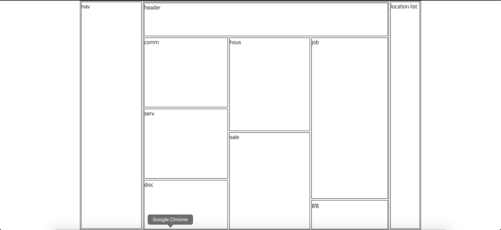

## Craigslist Layout

## Standard Setup Process

1. Create a repo called `lab-02c-craigslist-layout` on Github
    - make sure to click add a `README.md`
1. Copy the URL of the new repo
1. From the command line (terminal) clone your repo:
    1. Check with `pwd` that you are in correct directory for labs
    1. `git clone <url>`
    1. **`cd` into your repo from the command line**
    1. `npx create-alchemy-bootstrap .`
    1. Launch vscode with `code .`

### Goal

Create and deploy a minimalistic version of the craigslist front end using any combination of `flex`, `grid`, and (if you must) `float`. Don't stress over the details, just get labeled boxes.

Here's a screenshot of a plan for the div hierarchy: 

And here's a screenshot of a sample finished product:

## Points Break Down

Looking For | Points (10)
:--|--:
Deployed on GitHub pages, with link in the About section of the Github repo | 2
The content section is centered, with two unstyled margins | 2
In the content section, sidebars to left and right, with a bigger middle secion | 2
In the middle of the content section: a header, with ~7 boxes below the header in three columns | 4