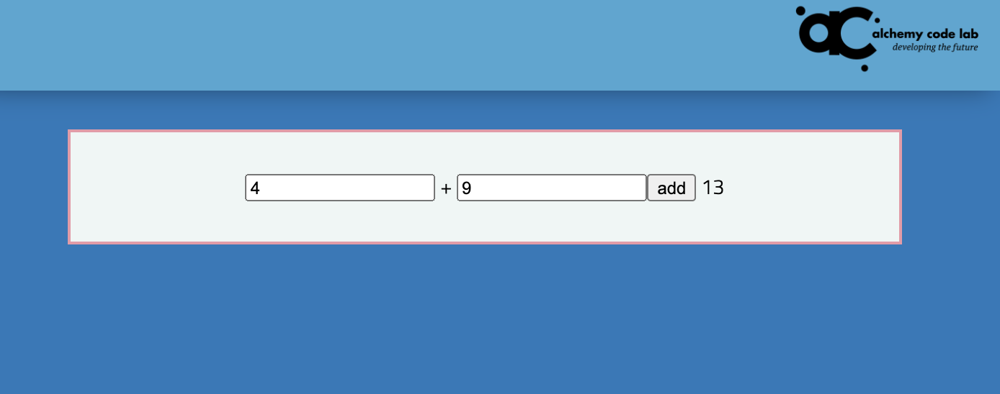
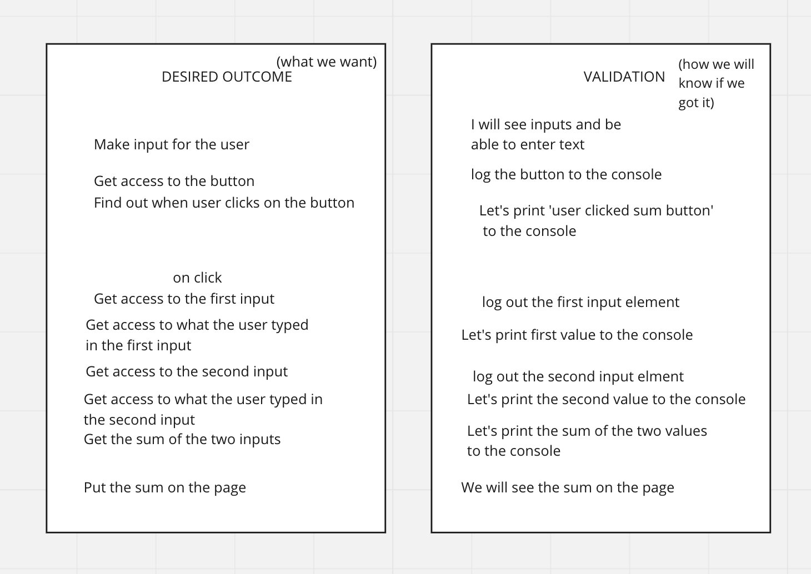

Let's build a calculator!
===

## Standard Setup Process

1. Create a repo called `lab-03b-calculator` on Github
    - make sure to click add a `README.md`
1. Copy the URL of the new repo
1. From the command line (terminal) clone your repo:
    1. Check with `pwd` that you are in correct directory for labs
    1. `git clone <url>`
    1. **`cd` into your repo from the command line**
    1. Launch vscode with `code .`

## Goal

There should be two inputs and one button for every operation. When the user enters numbers into the addition inputs, then clicks the add button, the sum should appear in the div.

It might look a little like this:

Repeat this process for subtraction, multiplication, and division.

## Some guidance:

1) In the HTML, Your inputs and buttons will need ids.
    - **Validation step**: look at the ids in the Elements tab in the browser
1) You will need to add event listeners to your buttons.
    - **Validation step**: log out 'Hello world! I am the add button' to validate that your event handler worked.
1) On click, you will need to be able to get the current number the user has typed into the inputs.
    - Get the inputs with `document.getElementById`
    - Get the value by using `.value` on the element
    - **Validation step**: Log out the values of the two inputs
1) On click, you need to add (or subtract, or multiply, or whatever) the two values that the user typed in.
    - **Validation step**: log out the correct value
1) In the HTML, you will need a span to put the answers into. The span will need an id.
1) On click, you'll need to put the correct answer into this span using its `textContent` property and the `=` assignment operator.
1) Repeat all of these steps for all four operations.