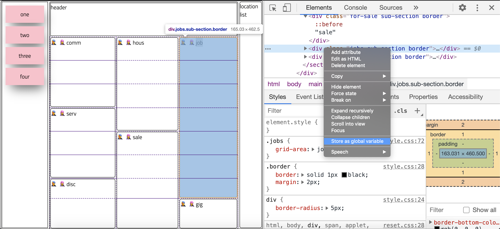
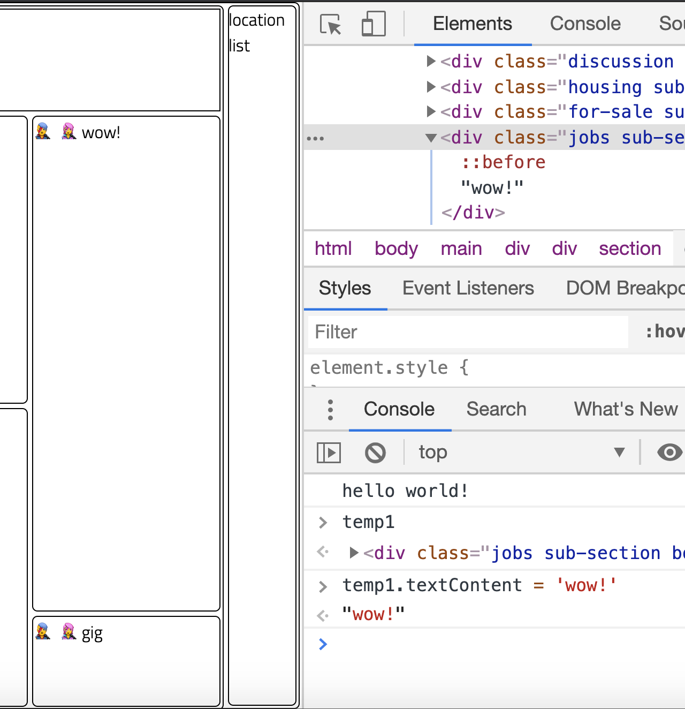

JS in the Browser 
===

> Introducing the DOM

## "Built-in's"

Utility object that are built into either:
* JavaScript
* The Browser (DOM)

Examples:
* `document`
* `console`
* `Math`

## Play with elements!

Follow these screenshots to play with an element live in the browser. With javascript, we can make HTML dance!


Note that we changed the `textContent` of `temp1` to 'wow', and this changed it in the HTML!



## `document`

This is where _alllll_ the magic lives.

### Finding Elements

```js
const result = document.getElementById('result');

// result is an element
```

Demo: Let's go grab stuff in craigslist in the browser!

### Reading Values

```js
const inputValue = someInput.value

const divText = someDiv.textContent
```

Demo: Let's go read stuff in craigslist in the browser!


## Changing Text

```js
const paragraph = document.getElementById('result');

paragraph.textContent = 'The text you want to show';
```

Demo: Let's go change text in craigslist in the browser!

## Changing styles

```js
const broccoliDiv = document.getElementById('broccoli');

// you can directly change the style of an element like so
broccoliDiv.style.color = 'green';

// or you can add and remove class names to change styles
broccoliDiv.classList.add('broccoli-box')
```

Demo: Let's go change styles in craigslist in the browser!

## Outcome
Let's add functionality to our nametag!
