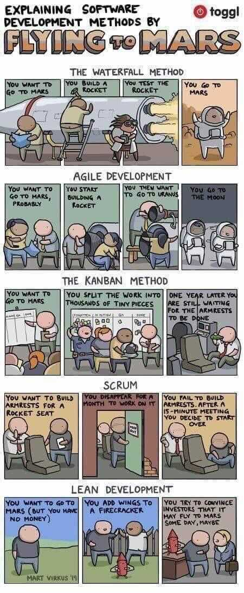
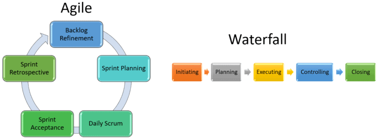
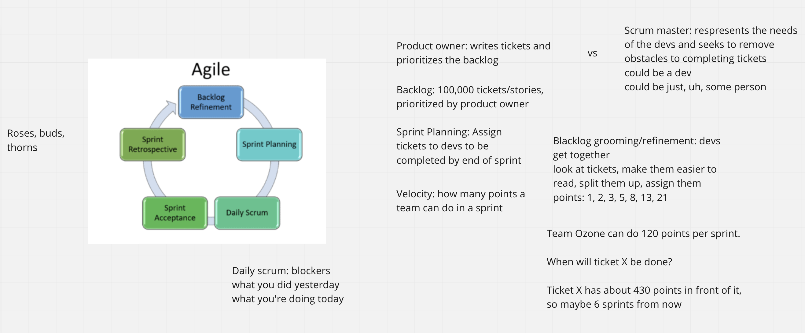

# Agile Practices and Teams

## Agile vs Waterfall

Waterfall teams get a rigid plan up front and stick to it as long as it takes to get it done. By the time the project is finished, though, _the world has left the project behind._

That's why more companies are trying to use agile methodologies. Agile teams ship code to production _constantly_--sometimes dozens of times times a day!

Because they ship so frequently, agile teams get constant feedback from client, and work without absolute rigidity to a final project blueprint.

https://www.blueoceanworkshops.com/agile-adaptive-vs-waterfall-predictive-project-management/

## Agile Practices

### Work in Sprints
 Ship 'working' (if not final) software at the end of a sprint. Set goals, assign tickets, and trust devs to 'get it done'.

### Agile Teamwork - one screen, many devlopers.

Pair programming and mob programming are common practices. It sounds like it might be a waste of developer time, but it actually _is faster_ in the long run than individual coding. 

- Why is it faster?
    1) Sharing knowledge: everybody becomes a generalist, nobody gets stuck into a corner of the project.
    1) Fewer distractions--continuous communication requires continuous focus
    1) Lateral thinking is easier in groups. Individuals tends to have their own 'style' for solving problems. Groups mix lots of these styles together.

### Product owner vs scrum main 

https://www.youtube.com/watch?v=y8OnoxKotPQ&feature=share

### Tickets

At the beginning of a sprint (however long that is in your organizatiopn), devs go and look at a pile of 'tickets', like the one below:

In the background, somebody called a 'product owner' has (supposedly) been spending their whole work week creating tickets and and organizing them by priority in response to client feedback and an ever-changing, long-term product roadmap.

In well-organized teams, devs meet like twice a week to 'groom the backlog'. This means they assign 'complexity points' to tickets, and try to make the feature descriptions as clear as possible, sometimes breaking work into multiple tickets. This makes assigning work painless.

At the sprint kickoff, devs take on as many tickets as they think they can handle for a the duration of the sprint.

## Git collaboration

Rules for successful collaboration.

0) Always branch from `main`.
1) When it's time for a new feature, checkout a new branch: `git checkout -b new-branch-or-whatever`
2) Make changes to this branch, then (ACP) push the branch to github.
3) Make a PR to main on github for this new branch.
4) Once the team agrees to the changes, merge the PR into main. Feel free to delete the branch in github.
5) Now, everybody should `git pull origin main` to get the freshest updates.
6) When it's time for you to code a new feature, go the main branch locally `git checkout main`, then `git pull origin main` to sync your branch up.
7) Now you're ready to repeat the process.

**Demo: The TAs and I make tickets and mob a small project with branches and PRs**

## Exercises

- [Madlib Project](./exercises/PROJECT-madlib-challenge.md)
