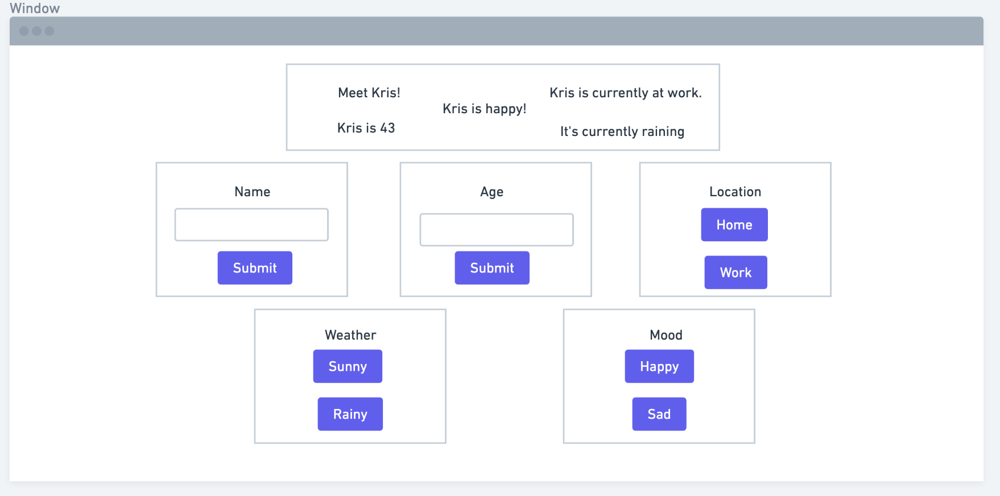

## Buttons and State

### Goal
Make an app that displays (and allows the user to manipulate) all the properties of a fictional character. For example, show their current location, their current mood, their name, their age, and the weather in their neighborhood. You can use any properties you want, but these are the ones I'll refer to in the instructions.

1) Make and clone a repo.
2) `alchemy-bootstrap` in the repo
3) Make a wireframe for a user interface that lets the user select a character's name, age with inputs. The wireframe should also include a way for the user to change the character's weather (sunny, rainy), mood (happy, sad), and current location (work, home) with a choice of TWO options. The site should change visually to represent the current state of the user. Add these wireframes to your repo. ACP.
4) In `index.html`, make these buttons and inputs. Give these buttons and inputs expressive and human-readable ids. Make a number input for age and a text input for name. Make buttons with ids for each of these inputs. Make buttons with ids for every weather option, every mood option, and every location option.
5) Also in `index.html`, make a container to display each of these properties of the character: a mood box, a weather box, a name box, an age box, etc.
6) Make a function called `updateName`. In this function, you should
    - Get the name input from the DOM.
    - Get the name container from the DOM.
    - put the input's `.value` property into the name container's `.textContent` property
7) Use `document.addEventListener` to add `updateName` to your name button.
8) Repeat steps 6-7 for the name property.
9) Make a function called `updateMoodToSad`. In this function, you should
    - Get the mood container from the DOM.
    - Set the mood containers `.textContent` property to 'Sad!'
10) Use `document.addEventListener` to add `updateMoodToSay` to the 'click' listener of your `Sad` button.
11) Repeat steps 9-10 for the `Happy` button.
12) Repeat steps 9-10 for the `Work` and `Home` buttons and the location container.
BONUS) Add images and styles that change based on the current state of the user. For example, show a raindrop in the weather container if it's raining, and change the site background to grey if the character is sad.
BONUS) Make `let` variables in global scope for weather, name, age, mood, and location. Whenever you change one of these properties in the DOM, update the appropriate `let` variable in global scope, and launch an alert that shows all of the current status of the user (their mood, name, age, and location).