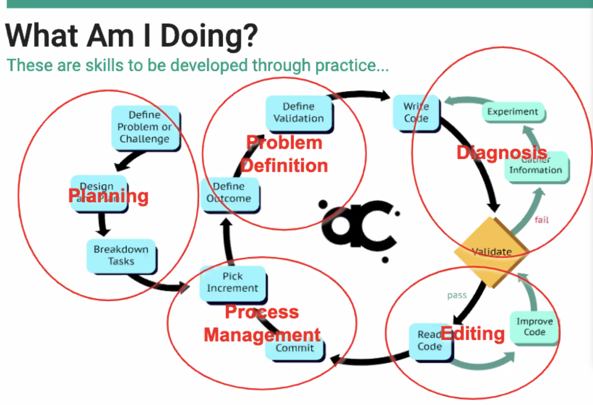
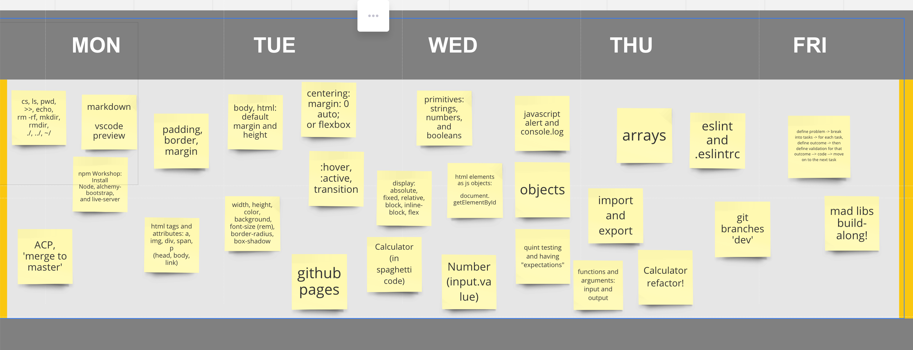
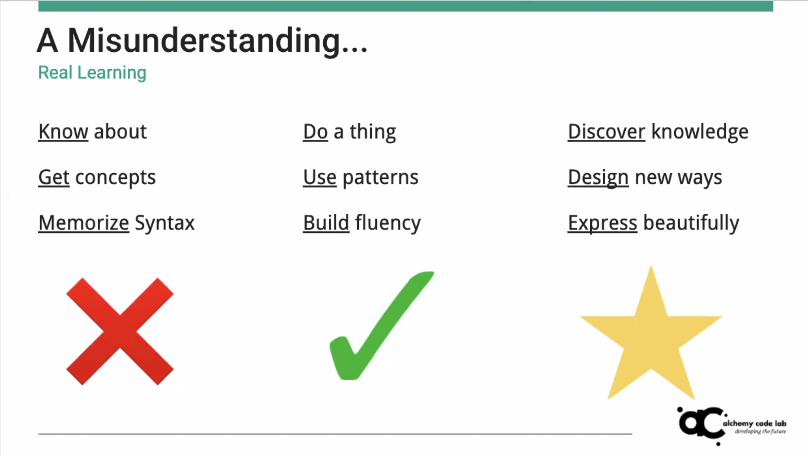

# Foundations Prep: On the Job Training!

### Welcome to Foundations Prep! We're going to spend five days giving you
practical "how-to" training on getting setup and using your tools like a
professional developer. 

This will include:
1. The terminal window (command line) 
1. Using Github and git to manage code
1. Integrated Development Environment (IDE)
1. Working with HTML and CSS
1. Working with JavaScript
1. Integrating JavaScript with HTML and CSS
1. Using Agile methodologies to plan and develop software

By the end of this week you'll have leveled up your development skills!

---

# Schedule
## Monday: Learning the tools
- Terminal
-  Github

## Tuesday: Making a Website
 - Semantic HTML
 - Attributes 
 - CSS Basics (selectors and styles)
 - Flexbox and Grid
 - Simple CSS Animations

## Wednesday: Putting it all Together!
 - JS basics
 - Calling functions (and passing arguments)
 - The DOM 
 - Calculator App

## Thursday: From Hobbyist to Professional
 - Alumni Panel
  - Declaring vs Calling functions
  - Testing Code with QUnit
  - Refactoring (Calculator App)

## Friday: What's it like on the job?
  - Ryan and Career Track!
  - Agile Practices vs Waterfall
  - Mad Libs Mob

---

## Get a TA's help
[Make a GitHub issue on this board to get a TA's attention](https://github.com/alchemycodelab/ta-room-Foundations)

## Resources
* [Mastering Markdown](https://guides.github.com/features/mastering-markdown/)
* Keyboard Shortcuts
  * [Mac](http://www.danrodney.com/mac/)
  * [Windows](http://www.hongkiat.com/blog/100-keyboard-shortcuts-windows/)
* Visual Studio Code
  * [The Basics of Visual Studio Code](https://code.visualstudio.com/Docs/editor/codebasics)
  * [VS Code Key Bindings](http://www.hongkiat.com/blog/key-binding-management-visual-studio-code/)
* Bash
  * [Easy Bash PS1 Prompt Generator](https://ezprompt.net)
* Git
  * [Git Documentation](https://git-scm.com/docs)
  * [Git Cheat Sheet](https://www.git-tower.com/blog/git-cheat-sheet/)
  * [How to Write a Git Commit Message](http://chris.beams.io/posts/git-commit/)

  Recordings:

  Monday:
Meeting Recording:
https://zoom.us/rec/share/_Y9Zc-jI1mpOe4nN2F7CYYMAIZ_eeaa8hHMf-vEOmE34vhAUwrGWw1Wi7wNEFkj2

Access Password: 9U@6#3J.

Topic: Danny Cairns' Personal Meeting Room
Date: Jun 22, 2020 08:25 AM Pacific Time (US and Canada)

Meeting Recording:
https://zoom.us/rec/share/xJwoBpbB5GJLY6Pi0miAHfc_XcPVeaa81CIa_PQIz09rcL8aX8yo1G6jDNr2lDZG

Access Password: 8F*.FD&

Tuesday
https://zoom.us/rec/share/tZBMIpH-03JISbPKyUHYeKk9Aobnaaa81iQZqfEKnU_9T7vJJ6ISqsKfM2pdfW6s Password: 6Q$050!8

Wednesday
https://zoom.us/rec/share/6t0tDJ-h9VhIUpH_5GTCVochR4vXX6a8gyYWr_QImEbvmGHxKMhqCrC-4klPeZGJ Password: 8I.&.?%#

## Danny Cairns' Personal Meeting Room

password: `5o&v^+f1`

* [6/25/2020, 4:04:27 PM - 6/25/2020, 6:02:04 PM](https://zoom.us/rec/play/7sAtJuyp-Go3SYCQ4QSDUaBwW9W5LqOsgHNPqKcNyUywACYCMVejNbVBZrSnDvlOjStCv_F1WlndMigf)
* [6/25/2020, 8:31:54 AM - 6/25/2020, 4:04:26 PM](https://zoom.us/rec/play/vJIlc72h-203G9HBsgSDCvN7W43rK6Ks2yhI-fRYmU-1BXAHZFf1MLtAMLeOdLAWEglOz1bNh0_S5-i4)

## Danny Cairns' Personal Meeting Room

password: `2H*lz$=4`

* [6/26/2020, 8:07:36 AM - 6/26/2020, 8:08:06 AM](https://zoom.us/rec/play/tZwoI-r-_zg3TNOWuASDVvd4W43pK66s0nQfqKBZyka9VHcLM1SuZrYVYbZy_QOKVEg5xpSBTkJMK2Qg)

## Danny Cairns' Personal Meeting Room

password: `6U*09LH%`

* [6/26/2020, 3:33:49 PM - 6/26/2020, 5:01:31 PM](https://zoom.us/rec/play/tJEsI-j7pjo3TNGc5QSDC_B5W9W6eP6s0XRI_PMFmE-yAnUAYVKjZrBDYuCFmOURM-ETg7OsMGjW7nzM)
* [6/26/2020, 8:44:31 AM - 6/26/2020, 3:33:47 PM](https://zoom.us/rec/play/750sd7r-rGk3HYCXsQSDCvFxW9XsJ_-s1SBMr_sLzB60BiIAYFf1b-cTauT8gduoiXqu886doMzviVnX)

## Danny Cairns' Personal Meeting Room

password: `8J&@*$2c`

* [7/6/2020, 3:25:45 PM - 7/6/2020, 3:25:54 PM](https://zoom.us/rec/play/uZYrc7-h-D83GtOTtwSDVKcrW47seKis1iMb_aYLzxy3W3VSYwenY7pEY-TwtkPYBTrVpCc9ngJISOyC)

## Danny Cairns' Personal Meeting Room

password: `3t*sIZOH`

* [7/6/2020, 8:15:52 AM - 7/6/2020, 1:27:45 PM](https://zoom.us/rec/play/6ZN8JOj-rzs3TNWV5gSDBf57W9W5e6ys0XAb8_QIzEiwWiFXYVP3brIRZevGHUDvSuMHErvvw4y0l5My)